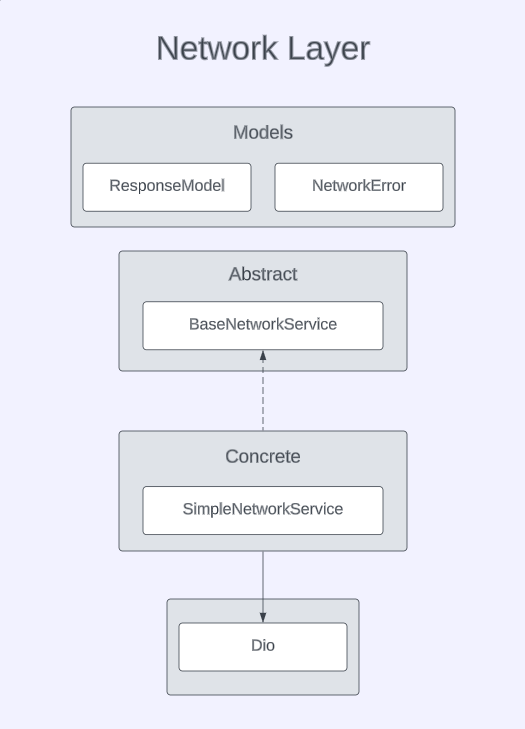
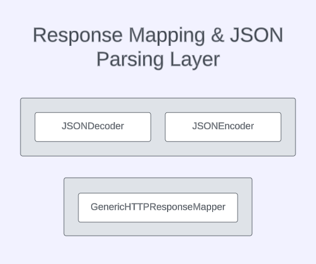
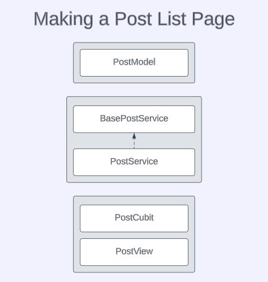

# Building a Custom Network Layer in Flutter
I will create my own network abstraction from scratch. Let's get started!

## We will do the followings:
1. Create a network layer
2. Create a JSON parsing layer
3. Make an example

## Network Layer
I will use  [dio package](https://pub.dev/packages/dio) but I don't want to be depend on that package. And maybe we will use [http package](https://pub.dev/packages/http) package in the future. So I will create my own response and error models. And I need to convert dio's response and error models to my models. I will use extensions to do this. 

## JSON Parsing Layer
We could parse the JSON data in the network layer but I think it's not a good approach. I think network layer just makes requests and return responses. Networking and parsing should be done separately.
And one more reason: APIs doesn't always return the data with status code 200. Some API's can work different. So I think separating networking and parsing layers is a good approach.
I created a JSONDecoder class to make decoding easier. And I created a GenericHTTPResponseMapper class. This class examines the response and, if successful, decodes JSON and returns data.
We can also create a specific HTTP Response Mapper class for specific cases. For example: The API returns user list with status code 204. So we need to create a UserHTTPResponseMapper class to parse data when the status code is 204. 

## Example
I will use jsonplaceholder API. This is the endpoint I will use: [posts endpoint](https://jsonplaceholder.typicode.com/posts)
I will fetch post list and show it in the ListView.
I will create the following classes:
1. PostModel: Data class(I recommend you to use [freezed](https://pub.dev/packages/freezed) and [json_serializable](https://pub.dev/packages/json_serializable) packages for the code generation. I didn't use it because it's a very simple example)
2. PostService: Fetch the data from API, parse it using GenericHTTPResponseMapper and return post list
3. PostCubit & PostState: Update PostView
4. PostView: Show post list in the ListView 

